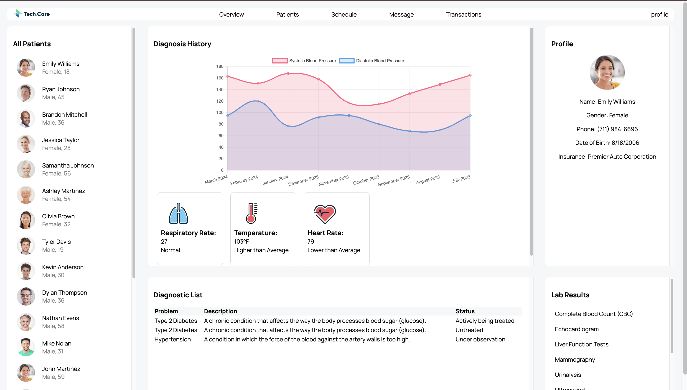

# Patient Dashboard

This project is a **Patient Dashboard** web application that dynamically fetches and displays patient data from an external API. The dashboard is designed for healthcare use, showcasing patient profiles, diagnosis history, diagnostic lists, and lab results in an interactive and visually engaging format. The app is built using HTML, CSS, JavaScript, and Chart.js for rendering charts.

Live Demo - https://suhaasteja.github.io/healthcare_dashboard/

---





## Features

- **Navigation Bar**: Provides easy navigation to different sections like Overview, Patients, Schedule, Messages, and Transactions.
- **Dynamic Patient Data**:
  - Fetches patient data securely from an API using `fetch` with Basic Authentication.
  - Displays patient details, diagnosis history, and lab results.
- **Interactive Diagnosis History**:
  - Shows a line chart of blood pressure (systolic and diastolic) trends using Chart.js.
  - Displays key health indicators (respiratory rate, temperature, heart rate) in square boxes below the chart.
- **Diagnostic List**: Presents the patient’s diagnostic details in a tabular format.
- **Lab Results**: Lists lab results as separate items for easy visualization.
- **Responsive Design**: The UI is designed to adapt to various screen sizes.

---

## Technologies Used

- **HTML5**: Structure of the web page.
- **CSS3**: Styling of the dashboard, including responsive design.
- **JavaScript (ES6)**: Logic for fetching and rendering data dynamically.
- **Chart.js**: For creating the diagnosis history charts.
- **Google Fonts**: Custom fonts for better typography.

---

## Setup Instructions

1. Clone the repository to your local machine:
   ```bash
   git clone <repository-url>
   ```
2. Open the project folder:
   ```bash
   cd <project-folder>
   ```
3. Open `index.html` in your preferred web browser to view the dashboard:
   ```bash
   open index.html
   ```

---

## How It Works

1. The `fetchPatientData` function fetches data from the API endpoint using Basic Authentication.
2. Patient data is rendered dynamically in the UI using JavaScript.
3. When a patient is clicked in the **Patients** section:
   - Their detailed profile is shown in the **Profile** section.
   - Their diagnosis history and health indicators are displayed in the **History** section.
   - Diagnostic and lab results are displayed in the respective sections.
4. The application uses Chart.js to display a line chart for blood pressure trends.

---

## API Reference

- **Endpoint**: `https://fedskillstest.coalitiontechnologies.workers.dev`
- **Authentication**: Basic Authentication with the username `coalition` and password `skills-test`.
## Credits

- **Chart.js**: For creating interactive charts.
- **Google Fonts**: For typography.
- **Icons**: Used for visual enhancements (e.g., health indicators).

---
